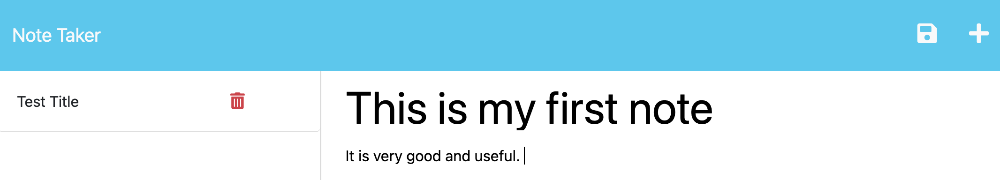

# wk11 - hanks-note-taker

## Description

The purpose of this project is to practice developing middleware and routing files to communicate with a server using Express JS. These files work with the already-developed html/css and javascript that create the style/function of the static pages. Heroku is used to create a live web address to allow other users to interact with the project code.

The following commands were entered into the terminal to run the application from localhost:
- npm init -y
- npm i express
- npm i uuid
- npm start
- node server.js

The 1st image below shows the home page of the application as deployed from localhost:3001

The 2nd image shows the notes page where a user can create, save, and delete notes

The 3rd image shows a list of created notes in the sidebar

The 4th image shows the same list of created notes as in image 3, but with one note deleted to prove the deleted functionality

## Installation

N/A

## Usage
Look. I don't know what I did. But I was at my wit's end and redid everything, like, 3924873958723940 times and it worked. So 
here's the [deployed Heroku web app](https://hanks-notes.herokuapp.com/)

## Credits

Resources used:
1) Bootcamp Pre-work Modules
2) Bootcamp 11-Express, mini-project (28)
3) [Express JS Crash Course](https://www.youtube.com/watch?v=L72fhGm1tfE)
4) [How to Deploy NodeJS (Express) Apps to Heroku](https://www.youtube.com/watch?v=27GoRa4d15c)
5) [Deploy with Heroku](https://www.freecodecamp.org/news/how-to-deploy-your-site-using-express-and-heroku/)

## License

Please refer to the LICENSE in the repository.
